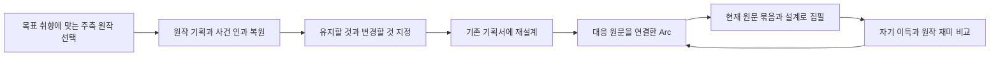

# 원작을 먼저 복원하고 제한적으로 재설계하는 제작 방법론

2026-09-05 · 방법론 제안 · 생산 코드 수정 및 신규 생성 없음

**2026-09-06 후속 합의:** 오너는 신규 Astra p01을 원작 중심 복원의 기준안으로 받아들였다. 이제 초반 사건과 투자 아이템을 다른 원문의 실제 사건으로 교체하고 배치를 바꾸는 단계로 진행한다. 아래 '가까운 변주'의 좁은 범위는 최초 복원 검증에 적용한 범위이며, 모든 후속 신작의 고정 제한이 아니다. 보존 기준은 자기 목적 → 개입 이유 → 우위 사용 → 자기 이익 → 구체적인 행동·반응의 쾌감 → 다음 목적이다. 원작 사실의 정확성과 의도적으로 바꾼 신작의 이행을 분리해서 심사한다. 사건마다 사람 승인을 받지 않고 초반 묶음의 변주 방향을 비교·선택한다. [현재 구현 범위](2026-09-06-source-variation-implementation-plan.md)

## 1. 이번 목표와 자기중심성의 정의

목표는 잘 쓴 기존 작품을 역설계한 뒤, 그 작품의 재미를 유지하면서 유사하지만 조금 다른 작품을 만드는 것이다. 새로운 주제·욕망·능력을 발명하는 실력을 우선 평가하지 않는다. 현재 InkOS의 기획→Arc/Rail→원고 골격은 활용한다.

오너가 이번에 명확히 한 자기중심성은 **주인공 자신이 가장 중요하고, 자신의 이득과 목표가 타인의 편의·평가·요구보다 우선하는 것**이다. 능동적이거나 자기 방식이 있다는 것만으로 충족되지 않는다. 자기 이익을 포기하면서 타인을 돕는 데 능동적인 인물도 있기 때문이다.

이 정의는 이번 제작 노선의 기준이다. 모든 웹소설이 그래야 한다는 일반론도, 원작 인물 모두가 이미 이 기준을 충족한다는 주장도 아니다. 앞선 [Drive 비교 문서](2026-09-05-drive-corpus-purpose-comparison.md)의 ‘자기 뜻·판단·만족이 행동의 중심’이라는 설명은 이번 기준으로는 불충분하다.

| 상황 | 이번 작품에서 요구하는 판단 |
| --- | --- |
| 내 몫을 줄여야 상대가 편하거나 나를 좋아한다 | 배려·호감을 위해 자기 이익과 목표를 양보하는 해결을 기본값으로 쓰지 않는다. |
| 타인이 나를 무시하거나 내 몫을 빼앗는다 | 가만히 견디는 것을 성숙함으로 포장하지 않는다. 되갚음·회수·배제·조건 변경 등 자기 쪽을 위한 대응이 있어야 한다. |
| 상대를 설득하거나 예의를 갖춘다 | 눈치를 보며 자기 목적을 낮추는 것인지, 자기 목적을 이루기 위해 상대를 다루는 것인지 행동과 결과로 구별한다. |
| 인재에게 보수·지분을 주거나 투자비를 지출한다 | 자기 목표를 위한 거래·투자라면 단순 지출과 손해를 등치하지 않는다. 다만 ‘언젠가 도움이 된다’는 사후 변명만으로 희생을 거래로 바꾸지 않는다. |
| 칭찬·사과·인정을 받는다 | 원한 돈·자산·승리·생활을 실제로 얻었는지 먼저 본다. 기분 좋은 말을 받았다는 이유로 포기한 자기 몫을 덮지 않는다. |
| 당장 힘이 없거나 대응 시점을 고른다 | 무능력한 출발과 남을 위해 스스로 양보하는 선택을 구별한다. 지연 대응을 택했다면 자기 이득을 위한 준비와 회수가 있어야 한다. 끝없이 미루는 굴욕은 제외한다. |

마지막 두 구별은 방법론 제안이다. ‘자기 목표를 위해서라면 무엇이든 참는다’는 예외를 넓히려는 뜻이 아니다. 장면 안에서 실제 선택·비용·수혜자·회수가 확인되어야 한다. 선행 후 ‘내 마음이 편해졌으니 자기 이득’이라고 붙여 넣는 식의 합리화는 이 기준을 통과하지 못한다. 휴식·쾌락·소유의 만족처럼 처음부터 자기 자신을 위해 원하는 것도 유효한 목표다.

## 2. 현재 시스템의 핵심 문제

현재 재설계 실패는 하나의 원인이 아니라 여러 단계에서의 의미 변경이다. 전부 새로 만들 필요는 없다. 기존에 잘 정의된 부분과 실제 실행을 맞추는 일이 먼저다.

| 현재 증거 | 판단과 수정 방향 |
| --- | --- |
| Reference Lab의 [Arc 분석 계약](../edge_repos/firefly_reference_lab/templates/work-arc-analysis-contract.md)은 실제 인물·사건·보상, 주인공의 자기 이득과 전용 HOW를 이미 요구한다. | 역설계 틀이 전부 없는 것이 아니다. 기존 분석이 그 요구를 실제로 충족하는지 원문과 맞춰야 한다. |
| [Transformation Pack README](../edge_repos/firefly_reference_lab/inkos_handoffs/doksik-chaebol3-transformation-pack/v1/README.md)는 주축 하나와 사건 순서·역할·압박·반전·보상·훅의 유지, 필요한 표면 변경을 이미 허용한다. | 사용자가 원하는 방향과 가깝다. 이 경로를 제작의 중심으로 삼는다. |
| [human-premise.ts](../edge_repos/inkos/packages/cli/src/commands/human-premise.ts) L339 이후는 돈·지분·권한 등을 지우고 특정 사람에게 바라는 욕망을 먼저 만들게 한다. L415 심사도 같은 기준이다. | 원작 복원 전에 중심 욕망이 바뀐다. 새로운 source-first 실행에서는 이 사전 발명 단계를 의무 경로에서 제외한다. |
| [Human Premise 스키마](../edge_repos/inkos/packages/core/src/planning/human-premise.ts) L74~83은 targetPerson, emotionalPayment, stillHumanWithoutPower를 필수로 받는다. | 프롬프트 끝에 ‘자기중심적이어라’를 추가해도 필수 구조와 충돌한다. 기존 스키마 의미를 몰래 바꾸기보다 기존 일반 pitch 경로를 source-first 방식으로 연결하는 편이 낫다. |
| [상업 피치 스킬](../edge_repos/inkos/packages/core/skills/inkos-commercial-webnovel-pitch/SKILL.md) L29~34는 욕망·목적을 먼저 잠그고 그 뒤 주축을 고른다. L53은 첫 보상에 물질·감정·목격자를 함께 요구한다. | 먼저 원작을 골라 인물과 목적을 복원하도록 순서를 바꾼다. ‘혼자 누리는 지급도 가능’이라는 같은 파일의 다른 지시와 충돌하는 의무도 정리한다. |
| [spine-retention.ts](../edge_repos/inkos/packages/core/src/planning/spine-retention.ts)는 업종·반복 동사·성장 사다리·보상 문법을 보존한다. | 누가 이득을 우선하는지, 무엇을 포기하지 않는지, 실제 선택의 이유까지 보존한다는 보장은 없다. 회차 수·좌표 수가 맞는 것으로 의미 보존을 대신하지 않는다. |
| [원문 인덱스 생성기](../edge_repos/firefly_reference_lab/tools/build-corpus-reference-pack.mjs) L289~298은 chapter_map의 목표·행동·보상을 인덱스로 옮긴다. | 요약의 잘못된 해석은 인덱스로 전파된다. 생성기가 새 욕망을 만든다는 뜻은 아니다. chapter_map부터 고치고 영향을 받는 파생 자료를 다시 만들어야 한다. |
| Human Premise 입력은 구조 파일의 앞 24,000자를 쓰며, story beat는 분석 행이고 실제 prose는 선택한 style example에 있다. | 원문 파일을 묶었다는 사실과 지금 필요한 인과를 읽었다는 사실은 다르다. 전체 개요와 현재 연결 구간의 원문을 구분해 공급한다. |
| [Writer reference store](../edge_repos/inkos/packages/core/src/reference/store.ts) L175~236은 실제 매핑 원문을 읽는다. 단, 해당 segment의 앞 최대 3화와 진행 시기의 첫 문체 예문을 사용한다. | Writer에 원문 경로가 없는 것이 아니다. 결말·반전·회수까지 필요한 묶음을 잘라 버리지 않도록 현재 사건 위치에 맞춰 선택해야 한다. |
| [preflight](../edge_repos/inkos/packages/core/src/reference/firefly-preflight.ts) L103 이후는 reference-required 경로에 변형 지도가 없을 때 진행률로 원천 회차 세 개를 골라 지도를 만든다. | 주인공의 지식·재산·상대·목적을 맞춘 대응이 아니다. source-first 작품에서는 기획의 명시적 대응을 쓰고, 없으면 해당 대응을 설계해야 한다. 모든 기존 실행에 이 fallback이 작동한다는 주장은 아니다. |
| [pitch promote](../edge_repos/inkos/packages/cli/src/commands/pitch.ts) L1254~1335는 후보를 brief와 pitch-selection으로 전달하지만, 보이는 기본 경로에는 선정한 원문 binding·변형 지도를 설치하는 명시적 단계가 없다. | 선정한 기획의 실제 source→target 대응이 Book과 Writer까지 유지되는지 통합 검증이 필요하다. 자연어 brief 전달을 구조적 연결 완료로 간주하지 않는다. |

즉, **원문 분석→피치→Book→Arc→Writer에서 같은 설계를 이어 쓰는 것**이 핵심이다. 새 양식이나 금지어만 추가하면 기존 충돌을 안고 한 단계가 더 늘어난다.

## 3. 원문이 보여 주는 기준 사례

이번에 「독식하는 재벌 3세」 52화 후반과 53화 앞부분을 직접 다시 읽었다. 원문은 [로컬 합본](../edge_repos/firefly_reference_lab/private_sources/korean_webnovel_corpus/서오/독식하는%20재벌%203세_서오_합본.txt)이며 파일·코드 해시는 [조사 기록](evidence/2026-09-05-source-first-redesign-methodology.json)에 남겼다.

- 52화 L9702 부근: 박진훈이 쫓겨나자 민재는 복수의 후련함을 느낀다. 상대를 배려해서 승리의 맛을 철회하지 않는다.
- 52화 L9758 부근: 사장 임명이라는 호의적인 제안이 와도 곧바로 만족하지 않고 지분을 요구한다.
- 53화 L9763 이후: 사장 직함만으로는 할아버지 뜻에 묶여 자기 방향으로 경영하지 못한다고 판단한다. 지분을 받아 자기 경영과 향후 성장의 기반을 확보한다.

이 구간을 ‘가족의 인정을 받는 유능한 손자’로 요약하면 부족하다. **적을 치운다→성공을 자기 몫으로 가져온다→허울뿐인 자리에 만족하지 않는다→자기 뜻을 실행할 소유를 얻는다**는 흐름을 읽어야 한다. 이 해석을 작품 전체의 모든 장면에 자동 확장하지는 않는다.

기존 Drive 독해도 이제 두 질문으로 다시 읽는다. 「국세청 망나니」의 응징 방식과 「대기업 말단이 일을 잘함」의 판을 만드는 능력은 참고 가치가 있다. 그렇다고 각각의 공적 사명이나 인정 욕구가 이번 작품의 최우선 목적에 적합하다고 자동 판정하지 않는다. 「망한 양식장을 물려받았다」의 자산→퇴사 구간은 좋은 국소 기준이지만, 초반 독해만으로 전편의 자기중심성을 인증하지 않는다.

## 4. 추천하는 제작 순서

### A. 주축 선택: 작품 평가와 취향 적합성을 나누기

잘 쓴 작품이라는 평가와 이번 목표의 주인공이라는 평가는 별개다. 주축은 원하는 자기중심성과 반복 재미가 이미 강한 작품으로 고른다. 제목·장르·흥행 이미지보다 실제 선택 장면을 본다. 큰 이익 앞에서의 선택, 모욕 대응, 타인과 이해가 충돌할 때의 처리, 성공 후 자기 몫을 챙기는 장면을 확인한다.

전편을 새로 분석하기 전에 기존 전수 분석으로 후보와 근거 구간을 찾는다. 시작·확장·후반의 대표 선택과 맞지 않는 사례도 함께 읽는다. 국소 발췌만 읽었으면 그 범위까지만 적합성을 말한다. 기존 자료에 전수 분석 완료 표시가 있다고 새 기준까지 통과했다고 간주하지 않는다.

주축에 맞지 않는 작품도 보조 참고작으로 쓸 수 있다. 잘 쓴 원작을 선한 주인공에서 이기적인 주인공으로 전면 개조해야 한다면, 이번 ‘조금 다르게’라는 목표에는 다른 주축을 고르는 편이 더 적합하다. 원문 자체를 왜곡해 그 문제를 숨기지 않는다.

### B. 역설계: 원작 그대로의 기획을 먼저 만들기

기존 `project_bible.md`, `project_pitch.md`, `chapter_map.csv`, `arc_atlas.md`를 활용한다. 오너 취향에 맞게 원작 사실을 바꾸지 않는다. 원작에 희생이 있으면 희생으로, 우정이 목적이면 우정으로 기록한 뒤 채택 여부를 따로 판단한다.

독해 단위는 문장 하나나 ‘폭로·성장·인정’ 같은 태그가 아니라 **선택이 시작되어 결과가 지급되는 연속된 사건 묶음**이다. 자연 NarrativeArc와 실행용 1~3화 ArcPacket의 길이는 다를 수 있다. 묶음의 다음 내용을 함께 유지한다.

- 처음 가진 것과 아는 것, 탐내는 자기 몫, 이번 구간에서 얻을 목표.
- 선택할 수 있던 다른 길과 실제 선택. 실제로 비교하지 않은 대안은 분석자의 추정이라고 표시한다.
- 사용한 능력·정보·재산·관계와 상대의 대응. 능력 설명뿐 아니라 써먹는 태도까지 기록한다.
- 누가 얻고 누가 부담하는지, 그 부담을 주인공이 왜 받아들이거나 거부했는지.
- 실제 지급과 그것을 누리는 장면, 이후 사용할 자원과 다음 목적.
- 독자가 먼저/늦게 아는 사실, 반전 공개 시점, 승리와 후일담에 쓰는 호흡.

이 정보는 기존 목표·행동·보상 항목의 서술과 해당 Arc의 근거에 담는다. 새 관리 문서 여러 개를 먼저 만드는 것은 권하지 않는다. 구현 때 기계적으로 대조해야 하는 정보만 기존 구조에 버전 명시해 보강한다.

### C. 재설계: 바꾼 항목 때문에 필요한 부분만 바꾸기

기본값은 원작에서 검증한 욕망의 우선순위, 이득을 챙기는 방식, 능력 사용, 상대를 다루는 태도, 보상 종류와 리듬의 유지다. ‘두 안이니 서로 다른 욕망을 만들라’고 요구하지 않는다. 같은 중심을 가진 가까운 변주도 후보가 될 수 있다.

바꿀 요소마다 `원작의 구체 요소 → 바꿀 요소 → 영향을 받는 원인·실행·보상·후속 사건`을 기존 transformation의 설명에 적는다. 이름·조직·물건·현장만 바뀌어도 작동 조건은 달라질 수 있다. 영향이 없다고 가정하지 않고 변경이 필요한 연결만 수정한다. 업종·능력·출발 자산이 중심 인과를 대거 바꾸면 ‘작은 변주’로 표시하지 않는다.

첫 검증에서는 주축 하나의 가까운 변주로 작동 여부를 본다. 보조작 혼합은 의무가 아니다. 이후 필요한 자리에서만 사건 묶음을 가져오며, 진입 시점의 정보·자산·인물 동기와 종료 후 보상이 다음 Arc에 연결되는지 맞춘다. 멋진 장면을 넣기 위해 새로운 우정·사명·희생 동기를 발명한다면 조합이 실패한 것이다.

문장 작성은 새 장면으로 수행하되 원문의 강한 단정, 탐욕스러운 속생각, 대사 공방, 반응과 보상에 배분한 호흡을 참고한다. 문장 길이 통계나 어휘 치환만으로 같은 재미가 재현됐다고 보지 않는다. 닮았다는 이유로 새 설정을 추가하는 벌점도 두지 않는다.

### D. 기획서→Arc→원고: 아래 단계는 앞 단계를 다시 발명하지 않기

| 단계 | 해당 단계가 결정할 것 | 상위에서 이어받을 것 |
| --- | --- | --- |
| 작품 기획 | 주축, 자기 이득의 우선순위, 장기 목표, 유지/변경 범위, 큰 사건 흐름 | 원작 복원 결과와 오너의 취향 |
| NarrativeArc 설계 | 이번에 얻을 것, 상대·자원·선행 조건, 승부와 지급, 다음 목적 | 같은 주인공의 우선순위와 변형 범위 |
| 1~3화 실행 ArcPacket | 현재 사건 묶음의 어느 부분을 쓸지, 정보 공개와 장면 호흡 | 전체 사건 묶음의 원인과 결산, 실제 직전 상태 |
| Writer | 행동·대화·속생각·감각을 장면으로 구현 | 목적, 이득의 귀속, 능력 사용과 결과, 대응 원문 |
| Review/Revision | 어떤 장면이 약해졌고 어디를 고칠지 | 오너 취향과 선정한 원작의 비교 기준 |

현재 상태가 계획과 달라지면 인과를 조정한다. 조정은 기획을 덮어 놓고 다른 이야기로 나아가는 허가가 아니다. 실제 원고에서 일어난 일과 아직 계획인 것을 구별하는 기존 InkOS 기능은 그대로 쓴다.

육하원칙 양식은 유지한다. 특히 WHY는 자기 이득이 왜 중요한지, WHAT은 실제로 가져갈 결과, HOW는 그것을 남의 뜻에 끌려가지 않고 얻는 방식이다. 이 답을 매 화 반복 낭독시키지는 않는다. 모든 회차가 새 성과를 내야 하는 것도 아니다. 이미 얻은 것을 쓰고 즐기는 회차도 유지한다.

## 5. 심사: 자기중심성·원문 충실도·읽는 재미를 별도로 보기

세 판단을 하나의 총점으로 합치면 문장이 매끄러운 우정안이 다시 살아날 수 있다.

1. **목표 취향:** 자신의 이득과 목표가 타인의 요구·평가보다 실제 선택에서 우선하는가? 최종 성과가 타인의 행복·칭찬으로 대체되지는 않았는가? 무시·침해에 어떻게 대응하는가?
2. **원문 보존:** 유지하기로 한 동기·우위·행동·승부·지급·호흡 중 무엇이 바뀌었는가? 실제 원문 위치와 결과 문장을 나란히 제시한다. SHA와 source ID가 있다는 것만으로 통과하지 않는다.
3. **상업적 읽힘:** 자기 이득을 챙기는 태도와 행동이 장면으로 느껴지는가? 승리·소유·복수·향유가 원문보다 밋밋해졌는가? 설명이 행동을 대신하는가? 이 판단에는 사람의 원문 대조가 필요하다.

반환물은 짧은 근거와 최소 수정으로 충분하다. ‘좋은 사람처럼 보이도록 양보시켜라’, ‘성공 전에 고통을 추가하라’, ‘능력을 줄여 신뢰를 증명하라’는 식의 일반 처방을 이 작품에 자동 적용하지 않는다. 반대로 실제 원문에 있는 실패와 배려를 역설계에서 지우지도 않는다. 그 원작 구간을 신작에 채택할지의 문제다.

사람의 기존 거절도 비교 기준에 포함한다. 새 카나리 p01 우정안은 ‘친구를 원하는 것도 자기 욕망’이라는 말로 되살리지 않는다. p02 약혼 거절안도 자립이라는 추상어 때문에 자동 구제하지 않는다. 두 안 모두 사용자가 거절한 방향이며 주축 원문의 중심을 교체했다.

## 6. 구현할 때의 순서와 범위

권고안은 **기존 일반 pitch→review→decision→promote 경로를 source-first 실행으로 연결하고, 독립 Human Premise 발명을 그 앞의 필수 단계로 두지 않는 것**이다. 기존 slate·심사·사람 선택 기록을 삭제하거나 선택된 전제를 몰래 교체하지 않는다.

| 순서 | 수정 대상 | 구체 변경 | 재사용할 부분 |
| --- | --- | --- | --- |
| 1 | 작품 발주와 공통 기획 지침 | 이번 자기중심성 정의와 유지할 원작을 먼저 명시. 욕망을 먼저 발명하게 하는 단계·필수 대인 결핍·돈 제거 심사를 새 실행에서 제외 | 기존 최종 기획서와 EntryContract의 selfInterest/purpose/HOW/보상 필드 |
| 2 | Reference Lab의 주축 분석과 파생 인덱스 | 주축 한 작품의 핵심 선택들을 원문 대조. 오류가 있으면 해당 원본 분석과 파생 자료를 함께 수정 | 기존 전수 chapter_map·Arc 분석·raw source 위치 |
| 3 | pitch와 spineRetention, reference transformation의 연결 | 현재 취향과 원작 인과를 후보에 연결. 선택된 설계를 Book의 원문 binding·변형 지도로 명시적으로 전달. 둘 사이 대응을 한 곳에서 생성 | 기존 source binding과 transformation, selection, Book 저장 구조 |
| 4 | reference store/preflight와 Arc | 진행률 기반 임의 대응 대신 실제 사건 대응. 현재 실행 부분과 그 원인·결산 원문을 선택. 잘린 문맥을 로그로 확인 | 실제 원문 해시 확인과 Writer 삽입 기능 |
| 5 | native pitch/review 및 공통 지침 | 필수 목격자와 감정 지급 충돌을 정리. 의미 보존과 자기 이득을 장면 대조로 심사 | 기존 review/수정/HIL 화면과 영수증 |

스키마 변경이 필요하면 버전을 명시한다. 기존 `stillHumanWithoutPower`에 다른 의미의 값을 억지로 넣는 호환은 하지 않는다. 구형 Human Premise 자료는 읽을 수 있게 두되 새 노선의 필수 입력으로 삼지 않는다. 일반 upstream/다른 장르의 제작 경로 전체를 이 취향으로 바꾸지는 않는다.

기획용 A/B의 상업 축과 실행 StoryRail의 A/B 정의는 이미 다르므로 새 연결에서도 그대로 등치하지 않는다. 자연 NarrativeArc를 실행 ArcPacket 1~3화에 억지로 압축하지 않는다.

## 7. 검증 순서: 또 새 전제 두 개부터 뽑지 않기

이 절은 다음 구현 이후의 실험 계획이다. 이번 조사에서 모델 실행이나 새 작품 생성은 하지 않았다.

| 실험 | 고정할 것과 바꿀 것 | 확인할 실패 |
| --- | --- | --- |
| 원작 복원 | 이름·사건·목적을 바꾸지 않고 기존 기획서로 복원. 주축 전수 분석과 선택한 연속 원문을 제공 | 이미 사랑받는 손자를 애정 결핍으로 바꾸는가? 선물을 성과 보상으로 바꾸는가? 자기 소유를 원하는 인물을 인정 욕구로 바꾸는가? |
| 가까운 변주 | 통과한 복원 결과에서 지정한 변경만 적용 | 작은 표면 변경 때문에 자기 이득·능력·보상까지 재발명하는가? |
| Arc와 짧은 집필 | 한 사건의 첫 선택부터 지급까지 연결. 필요하면 여러 실행 Packet을 사용 | 계획에는 탐욕이 있는데 원고에서 양보·눈치·훈계·절차 설명으로 바뀌는가? |
| 보조작 조합 | 가까운 변주가 작동한 뒤 필요한 사건 묶음 한 곳을 조합 | 주인공의 자원·정보·태도·다음 목적이 끊기는가? |
| 확장 구간 확인 | 초반과 다른 규모의 실제 원작 구간으로 재검증 | 도입부만 잘 흉내 내고 장편의 성장·누적 보상을 잃는가? |

처음에는 모델·입력 원문·분량·변형 범위를 고정하고 방법만 바꾼다. 모델 비교를 하려면 그다음 같은 입력으로 진행한다. 현재 Human Premise runtime schema는 모델을 `gpt-5.6-sol`로 고정하므로 설정 이름 하나만 바꿔 Astra 비교 완료라고 주장할 수 없다. 모델의 우열이나 개선 폭은 이번 조사로 입증하지 않았다.

기계 검증은 source 위치·매핑 연결·누락·하위 입력 전달을 맡는다. 자기중심성과 재미는 문장 유무 검사로 확정하지 않는다. 다음 사례로 심사 기준이 원하는 방향을 가르는지 먼저 확인한다.

| 대조 사례 | 예상 판단과 이유 |
| --- | --- |
| 원문 52~53화: 적을 치우고 사장 임명에 더해 지분을 받아냄 | 해당 구간은 자기 이득·목표 우선의 좋은 기준. 인정만으로 자기 몫을 대신하지 않음 |
| 임명·칭찬을 받자 원하던 지분 요구를 접는 해석 | 목표 취향과 보존 대상 모두 훼손. 별도 근거 없이 배려를 개선으로 볼 수 없음 |
| 직원에게 보수를 주고 그 능력으로 자기 사업을 키움 | 지출만 보고 희생으로 오판하지 않음. 실제 거래와 주인공 이익의 연결을 확인 |
| 타인을 위해 포기한 이익을 ‘마음이 편함’으로 정당화 | 이번 자기중심성 기준을 희석하는 합리화로 판단 |
| 돈을 받는 대신 사과·칭찬만 받고 넘어감 | 자기 목표가 대체됨. 원래 목표가 실제로 해결되었는지 확인 |
| 원문의 아픈 출발·초반 무력함 | 그 사실만으로 부적합 판정하지 않음. 이후 무엇을 우선해 어떤 대응과 회수를 하는지 읽음 |
| 실제 원작에 자기희생이 존재 | 역설계에는 사실대로 기록. 이번 주축/구간 채택은 따로 판단 |

이 표의 가상 대조는 심사 예시이며 새로운 작품 전제가 아니다. 수치 점수나 예시 통과로 상업적 성공을 보증하지 않는다. 작은 검증에서 실패하면 실패한 단계만 고친다. 독해가 틀렸다면 Writer를 재교육하는 대신 분석으로 돌아간다.

## 8. 비교한 대안과 검토 결과

- **자기중심성 규칙만 덧붙이기:** 새 취향은 표현할 수 있지만 필수 대인 욕망 스키마와 잘못 잠긴 전제를 해결하지 못한다. 단독 해결책으로 제외한다.
- **기존 원문을 더 많이 한 번에 넣기:** 자료는 풍부해지나 잘못된 요약 우선순위와 재설계 순서는 그대로다. 현재 필요한 원문 연결을 선택하는 방식과 함께 써야 한다.
- **처음부터 여러 원작 혼합:** 출처별 선행 조건이 늘고 무엇이 실패했는지 구별하기 어렵다. 첫 카나리의 방법 검증에는 쓰지 않는다.
- **새 플랫폼/새 대규모 양식:** 현재 source retrieval·Arc·Writer·HIL을 재구현할 이유가 없다. 기존 도구를 연결하고 충돌을 제거하는 안을 권고한다.
- **모델만 교체:** 비교 대상일 수는 있으나 기존 스키마와 심사 요구를 해결하지 않는다. 방법 고정 뒤 별도 변수로 시험한다.

외부 방법론도 확인했다. Aamodt·Plaza의 사례 기반 추론은 구체 사례를 찾아 재사용하고, 결과를 검증·수정한 경험을 다음 사용에 남기는 순서를 설명한다. 여기서는 ‘추상 창작 규칙보다 실제 사례와 수정 결과를 중심으로 운영한다’는 설계 참고로만 사용한다. 웹소설 흥행이나 이번 모델 성능의 검증 자료는 아니다. [원 논문, 1994](https://www.cs.auckland.ac.nz/~ian/CBR/AICom.pdf)

Gentner의 구조 대응 이론은 고립된 속성보다 연결된 관계 체계를 옮기는 관점을 제시한다. 여기서는 ‘재벌·우정·폭로’ 같은 태그 조합보다 이득·선택·능력·결과의 연결을 함께 옮기는 판단에 참고했다. 구체적인 인물·물건·말투를 삭제하자는 근거로 사용하지 않는다. 위 웹소설 적용 방식은 이번 작업자의 추론이다. [원 논문, 1983](https://groups.psych.northwestern.edu/gentner/papers/Gentner83.2b.pdf)

### 반례 검토

1. 최초 가설: 자기중심성 정의를 공통 지침에 강화하면 된다. 코드 대조 후 수정했다. 필수 스키마와 전제 생성 순서도 바꿔야 한다.
2. 두 번째 가설: 전제 생성만 고치고 원문 대응 경로를 쓰면 된다. preflight의 진행률 대응, Writer의 앞부분 선택, promote의 구조적 연결 공백을 확인한 뒤 수정했다. 원작 선택부터 Writer까지 한 대응을 이어야 한다.
3. 첫 재검토: 모든 원작이 이번 취향에 맞지는 않는다는 반례를 적용했다. 사실 복원과 취향 적합성을 구별하는 권고안으로 설명 가능하며 핵심 경로 변경은 없었다.
4. 두 번째 재검토: 거래 비용·지연 대응을 희생으로 오판하는 경우와 선행을 자기 만족으로 포장하는 경우를 적용했다. 실제 선택·이득·회수의 근거로 구별하는 권고안을 유지했다. 또 기존 원문 검색 기능을 재사용할 수 있음을 확인해 플랫폼 재구축을 제외했다.

두 차례 재검토에서 유지한 최종 권고는 **취향에 맞는 원작을 골라 실제 기획을 복원하고, 지정한 변경만 적용하며, 같은 이득·선택·보상 연결을 하위 제작 단계까지 전달한다**는 것이다. 실험 실행으로 효과가 입증된 상태는 아니다. 다음 작업의 첫 산출물은 새로운 우정안이나 자립안이 아니라, 주축 원작의 정확한 기획 복원과 변경 범위가 보여야 한다.
