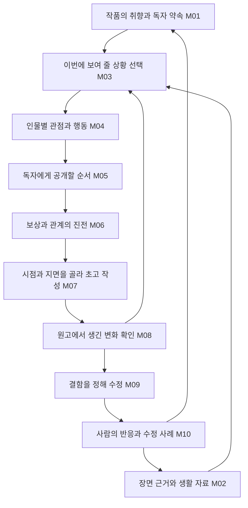

# 한국 웹소설 인간 작가: 조사 전체를 반영한 구현 설계

2026-09-12 KST · 설계 문서. 현재 실행은 [2시간 자동 개선 계획](2026-09-12-human-webnovelist-two-hour-run.md)을 따른다.

**후속 사용자 지시 반영:** 사람 HIL 대기와 장시간 장면 생성·피드백을 이번 구현의 선행 조건으로 두지 않는다. 아래 사람 비교 설계는 선택적인 후속 품질 연구로 남기고, 실제 작업 우선순위·완료 기준은 2시간 자동 개선 계획이 대체한다. 과거 피드백이 없어도 자료 연결·한국어 문맥·작법 입력을 구현하고 자동으로 검증한다. 후속 코드 적용과 영역별 잔여 범위는 [실제 구현과 사용법](2026-09-12-human-webnovelist-implementation.md)에 기록한다.

**전체 목표는 작품의 취향을 세우고, 재미있는 상황을 고르고, 인물을 움직이고, 독자가 경험할 순서를 정하고, 쓰면서 발견한 것을 반영하고, 사람의 반응으로 다음 선택을 개선하는 집필 체계다.** 작법 파일을 몇 개 넣는 기능은 이 목표의 입력 수단 하나다.

사용자가 “조사를 엄청 많이 하지 않았나? 왜 이렇게 얇지”라고 지적한 데 따라, [초기 구현 계획](2026-09-12-human-webnovelist-implementation-plan.md)을 전체 설계와 구별해 보존하고 이 문서를 현재 설계로 삼는다. 초기안의 첫 구현 순서는 이 문서의 작업 순서로 대체한다. 기존 조사 결과를 적용 경로로 옮기는 작업이며 새 외부 조사는 하지 않았다.

## 1. 초기안에서 빠진 것

초기안은 선택형 자료 묶음, 초고·퇴고, A/B, Rail에 집중했다. 전달·검증 방법은 있었지만, 조사한 작가적 능력을 충분히 분해하지 않았다.

| 빠지거나 약했던 것 | 이번 설계에서 보강한 것 |
|---|---|
| 사람이 쓰고 싶은 것과 독자 취향의 연결 | 작품별 창작 의도와 실제 선택 사례. 시장 지표와 개인 취향을 분리 |
| 참고작의 표면과 장면의 작동 방식 구별 | 장면 기능별 근거 서가와 다른 사건으로의 변형 연습 |
| 인물이 생각하는 것과 작가가 장면을 고르는 것 구별 | 인물의 제한된 관점과 작가의 사건·지면 선택을 각각 설계 |
| 정보격차·시점·공개 순서 | 세계의 사실, 인물의 믿음, 독자의 앎을 분리해 연결 |
| 중·후반, 조연, 보상 후 생활 | 약속의 시간 규모, 반복 피로, 관계의 지속, 다음 욕망 |
| 한국어 서술·대사의 구체성 | 공적/사적 말, 호칭, 화자 표시, 내면과 생략, 목소리 보존 |
| 쓰면서 바꾸는 판단 | 초고에서 발견한 변화와 미래 계획 수정의 실제 환류 |
| 피드백 기억 | 당시 본문·평가·수정 전후·채택 이유·적용 범위를 한 사례로 연결 |
| 이미 만들어진 시스템 사용 판단 | NovelWriter·WriteHERE·AuthorAgent의 독립 시험과 재사용/직접 구현 결정 |
| 사람 같은 글의 검증 범위 | 문장, 장면, 연속 회차, 다른 작품으로의 전이와 비용을 구별 |

나비계곡은 유연한 구상·결단의 내면·독자 반응 선택의 중요한 근거다. 정룡필의 작업 순서, 윤이수·산경·달새울의 다른 구상 방식, 조건상·서오·강동호의 실제 장면, GitHub와 커뮤니티의 구현·판단 사례도 각각 다른 자리를 갖는다.

## 2. 조사에서 설계로 이어지는 지도

| 조사 묶음 | 확인한 자산 | 설계에 연결할 곳 |
|---|---|---|
| [사람처럼 생각하는 저장소](2026-09-11-humanlike-thinking-repo-research.md) | 12개 저장소 항목. 피드백 기억, 상황 인식, 회상, 후보 비교, 수정 | M03·M04·M08·M09·M10 |
| [기존 집필 시스템](2026-09-11-ready-made-writing-systems-research.md) | 7개 주요 후보와 README 수준 보조 3개. 분석→집필, 재계획, 인물 검토 | M02·M03·M04·M08·M09, 별도 재사용 판단 |
| [작가 에셋](2026-09-11-human-webnovelist-assets-research.md) | 작법 파일, 선택·삭제 이벤트, 취향 비교, 생활 자료 | M01·M02·M04·M07·M09·M10 |
| [작법론 채널](2026-09-11-webnovel-craft-channels-research.md) | 10개 채널의 32개 자료 묶음. 재등장 자료와 미열람 본문 포함 | 전 영역. 카쿠요무는 편집 판단, Writing Excuses는 약속·진전·지면 |
| [정룡필·디씨](2026-09-11-jeongryongpil-dc-craft-research.md) | 직접 기획 과정, 정보격차, 기대감, 대화 전후, 조연 유지 | M03·M05·M06·M07·M10 |
| [한국 작가 마인드](2026-09-11-korean-webnovelist-mind-supplement.md) | 인터뷰 7건. 서로 다른 구상·독자 대응·경험·수정 | M01·M02·M07·M08·M09·M10 |
| [실제 원고 연구 연결](2026-09-11-human-writer-quality-study.md), [초기 분석](../edge_repos/firefly_reference_lab/comparisons/2026-09-11-author-thinking-and-prose.md), [중·후반 분석](../edge_repos/firefly_reference_lab/comparisons/2026-09-11-author-craft-mid-late.md) | 5작품의 초기 22회차 단위, 추가 7회차 전체와 일부 구간 | 외부 작법이 실제 문장의 장점을 지우는지 확인하는 기준 |
| [D01~D10 판단 카드](korean-webnovelist-decision-cards.md) | 문제별 질문과 반례 | 자료를 찾는 짧은 진입점. 시스템 전체나 품질 점수표로 쓰지 않음 |

네 자료 목록에는 합계 73개 **기록 행**이 있다. 같은 저장소·자료의 재등장이 있으므로 73개의 독립 원출처나 정독 자료를 뜻하지 않는다. [자료별 구현 연결표](evidence/2026-09-12-human-webnovelist-research-implementation-map.json)는 이 73개 행, 사고 저장소 12항목, 기존 시스템 10항목, 원고 분석 2건과 카드 10개를 각각 기능·사용 범위·보류 이유에 연결한다. 미열람 책이나 영상도 누락시키지 않되 창작 지침의 근거로 승격하지 않는다.

## 3. 전체 동작과 데이터

열 개 영역은 열 개 에이전트나 열 번의 모델 호출을 뜻하지 않는다. 하나의 장면 작업 문맥 안에서 필요한 판단을 조합한다. 기존 Planner·Writer·Reviser·상태 갱신이 실행을 맡고, 단순한 회차에서는 추가 탐색 호출을 하지 않는다.

자료 구조도 별도 데이터베이스 열 개를 만들지 않는다. 아래는 **신규 계약 후보**이며 기존 타입 이름이 아니다. 실제 구현에서 기존 필드로 충분한 것은 투영해서 사용한다.

| 기록 | 필요한 내용 | 저장 주체와 권한 |
|---|---|---|
| `CraftCase` | 출처·읽은 구간, 상황, 인물 선택, 공개 순서, 독자가 겪은 효과, 해석, 반례, 사용 결과 | Reference Lab의 파생 분석. Book 사실과 분리 |
| `BookCreativeBrief` | 보고 싶은 순간, 주인공의 사적 욕망, 반복해서 줄 즐거움, 유지할 목소리, 그 근거인 사람 결정 | InkOS 작품 문맥에 기존 승인 경로로 투영. 원래 결정은 Storyyard에 유지 |
| `SceneDecision` | 장면 목적, 선택한 사건, 인물의 믿음·자원·행동, 독자 공개 순서, 펼칠/줄일 구간, 근거 ID | 기획 단계는 Foundry 산출물, 제작 단계는 InkOS. 긴 사고 전문을 기록하지 않음 |
| `DraftObservation` | 실제 본문 해시와 위치, 계획 대비 변화, 얻은 만족, 남은 기대, 미래 계획 영향 | InkOS 후보 관찰. 승인 전 관찰과 확정 상태 구별 |
| `RevisionCase` | 원본·수정본 해시, 문제 위치, 수정 의도, 보존할 장점, 실제 차이, 사람의 전후 판단 | InkOS 수정 후보와 Storyyard 결정 참조를 연결 |
| `ReaderDecision` | 실제 읽은 범위, 본문 위치, 원문 의견, 선택·동률·확신 없음, 제안과 관찰의 구분 | Storyyard. 모델 진단은 별도 필드·출처 |

학습의 기본 단위는 “장면에 대한 결정과 그 결과”다. ‘독백 싫음’이라는 한 줄만 축적하지 않는다. 작품의 사실 기억, 등장인물의 믿음, 독자의 지식, 창작 경험의 기억은 섞지 않는다. 가중치 학습 없이 기록과 검색으로 시작할 수 있다.

## 4. 열 개 구현 영역

### M01. 작품별 취향과 독자 약속

**문제:** 참고 소재·능력·배경을 조립해도 작가가 보고 싶은 장면과 독자가 다시 올 이유가 빠질 수 있다.

- 근거: 탄마의 자기 독자, 정무늬의 자기 매력과 소비 방식, 비가의 익숙한 소재와 자기 스타일, 한산이가의 보고 싶은 관계, LiteraryTaste의 선언 취향과 실제 선택 차이.
- 입력: 현재 작품의 기획, 사용자가 좋아하거나 버린 본문과 이유, 유효 범위가 있는 시장 관측.
- 동작: 취향을 ‘장르 이름’에서 장면의 선택으로 좁힌다. 돈을 좋아한다면 어떤 대접·소유·거절권·통제감을 보고 싶은지 구체화한다. 같은 취향이 다음 작품에서도 적용되는지는 근거를 확인한다.
- 출력: 짧은 `BookCreativeBrief`와 그 근거 참조. Market Radar의 유행을 사용자의 취향으로 자동 채택하지 않는다.
- 연결: 기존 기획 입력과 InkOS 장르/작품 문맥. 새로운 세계관 승인이나 보편 금지 규칙이 아니다.
- 확인: 사용자가 고른 즐거움이 기획 설명뿐 아니라 실제 장면에 나타나는가. ‘공장 효율이 올랐다’가 자동으로 재미 판정을 받는 식의 오류를 찾는다.

### M02. 기능별 장면 근거와 생활 자료 서가

**문제:** 작품 전체를 평균 문체로 요약하거나 앞부분만 넣으면, 중·후반의 생활·오판·관계·회수 방식을 잃는다.

- 근거: 조건상·서오·강동호 원고, NovelWriter의 분석 결과 단계별 전달, haowjy의 기능별 문체 참고, HZ-KMNO의 작가를 위한 분석, 스토리테마파크, 산경·목련의 서의 경험.
- 동작: ‘작가명’ 외에 장면의 기능으로 찾는다. 같은 제안을 다른 이유로 수락하기, 주인공의 잘못된 첫 판단, 위험을 넘는 결단, 성공 후 생활, 강한 상대와 협상, 오래된 조연의 재등장 등을 구별한다.
- 한 사례에 필요한 것: 이전 조건, 인물의 목적·선택, 공개 순서, 실제 문장 위치, 이후 반응, 아직 읽지 않은 범위. 줄거리 요약과 연구자의 해석도 구별한다.
- 연결: Reference Lab의 분석·열람 기록을 원본으로 유지하고 InkOS `materials/retrieve.ts`와 선택 문맥을 재사용한다. 기존 검색 점수에 장면 문제·읽은 범위 적합성을 더하는 어댑터를 검토한다.
- 새 작업: 앞 7,000자 입력 외에 선택 장면을 공급하는 경로, 조회 결과의 사용 이유, 전체 묶음을 주입하지 않는 선택·분량 제한.
- 확인: 다른 소재의 장면에서도 판단 원리가 도움이 되는가. 원작의 고유 사건·대사·인물 조합을 옮기거나 읽지 않은 결말을 근거로 쓰지 않는가.

### M03. 소재에서 사건으로, 사건에서 보여 줄 장면으로

**문제:** 인물 행동이 자연스러워도 그 과정을 길게 읽고 싶지는 않을 수 있다. 작가의 선택이 별도로 필요하다.

- 근거: 정룡필의 기획→에피소드→힘줄 구간, 노쓰우드 재게시의 작성 후 실제 사건 확인, Tree of Thoughts의 제한된 대안 비교, WriteHERE·StoryDaemon의 진행 중 선택.
- 동작: 이번에 줄 즐거움을 위해 요청·거절·오해·시험·양보·폭로 중 무엇이 상황을 바꾸는지 고른다. 갈림길에서만 소수 대안을 만들고, 독자가 기다릴 반응과 인물 목적이 실제로 달라지는 대안을 비교한다.
- 출력: 기존 Memo의 목표·본문에 들어갈 짧은 장면 선택과, 필요할 때 버린 대안 및 이유. 매번 세 후보를 강제하지 않는다.
- 연결: HQ의 현행 기획 경로와 InkOS Planner를 단계별로 연결한다. Foundry의 Scene Forge·BR0는 역사적 규칙의 존재와 현행 실행 여부를 분리해 재사용 가능성을 검사한다.
- 확인: 설정 이름만 바뀐 후보가 아닌가. 새로운 정보를 얻었을 때 인물의 다음 행동이 달라지는가. 절차를 줄이면 독자가 기다리는 장면이 더 잘 살아나는가.

### M04. 인물의 관점·기억·관계가 행동을 바꾸게 하기

**문제:** ‘영리함·냉정함’ 같은 성격표만으로는 누구 앞에서 무엇을 믿고 왜 다른 말을 하는지 충분히 정해지지 않는다.

- 근거: Concordia, Generative Agents, DAYDREAMER, Cognitiv, wgwtest, 한국어 대화 DNA, 조건상의 자기식 해석과 강동호 가족의 다른 반응.
- 동작: 현재 사건에 필요한 경험만 회수한다. 사실/전언/추정/오해, 사적 욕망, 공개 명분, 가진 자원, 상대와의 관계를 기준으로 가능한 행동을 고른다. 감정은 주의를 어디에 쓰고 무엇을 피하거나 밀어붙이는지에 영향을 준다.
- 출력: 장면에 필요한 인물별 관점 투영. 모든 인물에게 상처·비합리성·실수를 추가하지 않는다. 능숙하고 합리적인 선택도 근거와 목적이 있으면 된다.
- 연결: 기존 `character_matrix`, 관찰 상태, `memory-retrieval.ts`, Planner의 인물 문맥. 마을 전체를 매 순간 시뮬레이션하는 새 서버를 먼저 설치하지 않는다.
- 새 작업: 세계 사실을 특정 인물의 앎으로 그대로 복사하지 않는 투영과 근거 연결. 기억을 지우거나 상태를 확정할 때는 기존 InkOS 정사 경로를 따른다.
- 확인: 상대가 장면을 바꾸는 반문·행동을 하는가. 걱정과 욕심, 애정과 사익이 함께 있을 수 있는가. 인물마다 해설만 길어지고 본문 행동은 그대로인 경우 실패다.

### M05. 독자에게 무엇을 언제 알릴지 설계하기

**문제:** 정보격차 칸이 존재하는 것과 독자가 상대 반응을 기다리는 것은 다르다.

- 근거: 웹연갤 정보격차 3부작, 서오의 주인공 계획과 상대의 다른 계산, 태린의 시점 경험, 한국어 독자 지식표, Writing Excuses의 대사 이면.
- 동작: 세계에서 참인 것, 인물이 믿는 것, 독자가 읽은 것을 따로 둔다. 공개 전에는 무엇을 기다리게 할지, 공개 뒤에는 누구의 행동·관계가 바뀔지 고른다. 주인공보다 독자가 더 많이 아는 장면도 허용한다.
- 출력: `SceneDecision`의 공개 순서와 독자 기대, 작성 후 실제 공개 위치. 전체 스포일러를 모든 시점 인물에게 배포하지 않는다.
- 연결: 기존 `utils/pov-filter.ts`, Writer의 문맥 분기, hooks와 회차 요약. 현재 필터가 존재한다는 이유로 완전한 인물 지식 모델이라고 부르지 않는다.
- 확인할 코드상 빈틈: 읽은 POV 유틸의 회차·정보 경계 인식에는 중국어/영어 중심 패턴과 등장 여부 휴리스틱이 있다. 한국어 제목·표·동명이인·전해 들은 정보 fixture로 실제 경로를 확인한다. 한국어 집필 전체가 실패한다고 단정한 것은 아니다.
- 확인: 같은 사건과 결과에서 공개 순서만 바꿔 더 기다리고 싶은 쪽을 비교한다. 주인공의 알 수 없는 정보 사용, 필요 없는 비밀 유지, 설명만 하는 반전은 각각 구별한다.

### M06. 보상·진전·조연을 장기적으로 유지하기

**문제:** 매번 더 큰 돈과 적을 추가하거나 만족 직후 위기를 덮으면 보상을 느끼지 못하고 기존 인물이 소모된다.

- 근거: 강동호의 성과 후 일상·대우, 서오 후반의 힘을 쓰고 싶은 대상, 웹연갤 기대감·조연 유지·감정선, oh-story의 보상 귀속, Writing Excuses의 진전감.
- 동작: 장면·회차·에피소드·작품 단위의 약속을 연결하고, 이번에 무엇을 지급했는지 본문에서 찾는다. 승리 후 체감할 시간을 둘 수 있다. 다음 욕망은 기존 힘을 무효화하지 않고 새로운 관계·규칙·자존심에서 생길 수 있다.
- 조연: 지난번 큰 반응 뒤에도 자기 목적, 익숙한 교류, 협력 방식, 다음에 할 일이 남는지 본다. 일정 횟수마다 감정선을 뒤집거나 새 인물로 교체하지 않는다.
- 연결: 기존 `HookRecord`의 `expectedPayoff`, `payoffTiming`, 의존 관계, subplot·emotional arcs, Rail closeout의 reader debt. 새 약속 장부를 중복 생성하기보다 기존 항목과 본문 근거를 연결한다.
- 추가 확인: future-advantage ledger에는 실제 본문 근거 연결이 이미 있으나, 이 구조가 모든 작품의 보상·관계 재미를 포괄한다고 보지 않는다.
- 확인: 금액·사건 수가 늘지 않아도 달라진 선택권·대접·관계가 읽히는가. 다음 회차만 당기고 이번 만족은 계속 미루는가. 재등장 조연을 다시 보고 싶은가.

### M07. 한국어 문장, 목소리, 시점과 지면 배분

**문제:** ‘사람처럼 써라’나 AI 표현 제거만으로는 어디서 독백을 길게 하고, 무엇을 생략하고, 어떤 대사를 남길지 정하지 못한다.

- 근거: 조건상의 관찰→자기 해석→행동, 서오의 겉말/속말, 나비계곡·달새울의 내면, 비가의 쉬운 용어, 박망생의 대화 수정, haowjy·wgwtest·oh-story의 목소리 보존.
- 동작: 기능에 따라 직접 설명·내면·대화·행동·장면 생략을 선택한다. 관계와 공적/사적 자리에 따라 호칭·말끝·완곡함·거절·생략이 달라지게 한다. 표정·몸짓을 감정마다 덧붙이지 않는다.
- 지면: 독자가 반응을 기다리는 순간과 결단·보상은 펼칠 수 있고, 반복 절차는 줄일 수 있다. 장면 수나 문장 길이 비율을 재미의 대리 지표로 쓰지 않는다.
- 연결: 기존 style profile, dialogue fingerprints, Writer·Reviser. `style-analyzer.ts`에는 한국어 통계 분석이 이미 있다. 이 수치가 장면 기능이나 사람다운 목소리를 측정하는 것은 아니다.
- 새 작업: 기능별 참고를 전달하고, 유효한 작품 지시와 범용 처방이 부딪힌 실제 사례를 기록한다. 기존 초반 회차·비유 빈도 등의 처방을 조정할 때는 선택형 분기와 전후 비교로 처리한다.
- 확인: 필요한 독백·농담·화자 표시를 삭제하지 않았는가. ‘짧고 깔끔해졌지만 재미와 사람의 속셈이 사라진 글’은 개선으로 세지 않는다. AI 탐지기 점수는 목표에서 제외한다.

### M08. 쓰면서 발견한 것을 다음 설계로 돌려보내기

**문제:** 초고가 계획과 달라졌는데도 계획을 복사해 다음 회차를 쓰거나, 새 발견을 모두 정사로 확정하면 연속성이 무너진다.

- 근거: WriteHERE의 목표 갱신, StoryDaemon의 다음 장면, 나비계곡의 유연성, 윤이수·산경·달새울의 서로 다른 고정 범위, 노쓰우드의 작성 후 요약.
- 동작: 계획한 사건과 실제 쓴 선택·결과를 비교한다. 유효한 새 욕망·관계·부채를 표시하고, 현재 원고를 수정할지 미래 경로를 바꿀지 선택한다. ‘계획대로 썼는가’와 ‘더 나은 선택이 생겼는가’를 따로 본다.
- 연결: 기존 회차 요약·상태 delta·Arc closeout·B-Rail reflow. 현재 정사와 승인된 anchor는 보존한다. 미승인 초고의 발견은 후보로 남긴다.
- 모드 설계: 결말·주요 장면 고정형, 큰 방향만 고정한 경로 유연형을 기존 계약 안에서 먼저 비교한다. 결말까지 열어 두는 모드는 전체 설계의 후속 항목으로 유지한다.
- 열린 결말 모드의 별도 작업: 현재 ready가 요구하는 anchor/결말 경로, reflow의 anchor `keep` 제약, 미지의 끝을 표시할 상태, 지급할 약속과 미정 영역, 실행 입장·마이그레이션을 새 버전으로 설계한다. 필드를 비워 검사를 통과시키지 않는다.
- 확인: 쓰다가 더 나은 선택이 생기면 이후 계획이 실제로 달라지는가. 편의적인 설정 번복이나 계속 계획만 고치는 루프는 실패다.

### M09. 결함을 찾아 필요한 만큼 퇴고하기

**문제:** ‘더 자연스럽게’라는 요청과 모델 자체 점수만으로 후보를 고르면 표현만 매끈해지고 좋은 특징이 사라질 수 있다.

- 근거: Self-Refine, AuthorAgent, 카쿠요무 공개 강평, 박망생 수정 전후, WasabiDog의 인물 의도→대사 변경, 원고 분석의 반례.
- 동작: 먼저 문제를 작품의 핵심 재미 / 장면 선택·순서 / 정보 공개 / 인물 목적 / 관계·목소리 / 중복 표현 중 어디에 있는지 정한다. 그 수준의 최소 수정안을 만든다. 상위 원인이 남았는데 어휘만 바꾸지 않는다.
- 출력: 원본과 후보, 결함 위치, 독자에게 생긴 불편, 변경 목적, 보존할 장점, 실제 차이. 사람 판단이 없으면 효과 미검증으로 남긴다.
- 연결: 기존 Reviser의 명시적 수정 지시·advisory 경로·원본/후보 저장. 일반 작법 판단을 자동 critical 실패로 추가하지 않는다.
- 확인: 지적한 결함이 실제로 고쳐졌는가. 속도·농담·내면·주인공의 사익·관계를 함께 훼손하지 않았는가. 반응이 좋아진 이유가 단순 추가 호출·긴 분량인지 분리한다.

### M10. 사람의 편집 경험을 기억하고 다음 선택에 활용하기

**문제:** 댓글이나 ‘좋음/싫음’만 다음 입력에 넣으면 무엇이 문제였는지 알 수 없고, 특정 작품 취향이 전체 금지 규칙으로 번진다.

- 근거: Reflexion, CoAuthor, LiteraryTaste, Wordcraft, 카쿠요무, 나비계곡·정룡필·Wales·Wildbow의 연재 독자 대응, 김준현의 창작 과정 구분.
- 동작: 당시 본문, 읽은 범위, 실제 의견, 수정안, 선택 결과를 연결한다. 문제를 관찰한 말과 독자가 제안한 해결책을 구별하고, 채택/거절 이유를 남긴다. 성공 사례와 실패·동률도 검색한다.
- 현재 확인한 공백: HQ `scope_hil()`은 피드백의 원본·후보 범위를 잘 보존하지만 `reviewed-text-not-loaded`를 표시한다. 실제 검토 본문을 해시로 회수하는 어댑터가 우선 필요하다. 본문을 못 찾으면 해석을 발명하지 않는다.
- 기억 검색: 같은 장르·장면 문제·관계·작품 약속에 맞는 사례를 고른다. 관련성 외에 적용 범위, 반례, 원문 접근 여부를 검사한다. 최근 부정 의견만 반복 주입하지 않는다.
- 연결: Storyyard 결정 원본, InkOS HIL 후보/적용 기록, Reference Lab의 파생 사례. 기존 사실·요약·hooks 기억을 편집 경험 저장소로 덮어쓰지 않는다.
- 확인: 전에 지적받은 문제가 다른 독립 장면에서도 나아지는가. 한 번 싫었던 사업 사건을 모든 현대판타지의 금지 소재로 일반화하지 않는가. 새 독자와 최신 독자의 문제를 모두 자기 위치에서 해석하는가.

## 5. ‘이미 누가 만든 것’을 먼저 쓰는 결정

초기안은 이 질문을 충분히 보존하지 못했다. 외부 앱을 현재 제품으로 바로 갈아 끼우는 것과, 아무것도 써보지 않고 전부 새로 구현하는 것 사이에 선택지가 있다.

| 후보 | 먼저 확인할 독립 사용 | Firefly에서 대체할 수 있는 작업 | 직접 구현으로 넘어갈 조건 |
|---|---|---|---|
| NovelWriter | 고정 커밋의 분석→단계별 지침→회차 생성 경로를 격리된 창작 fixture로 실행 | M02의 분석 전달, M07의 참고 적용 | 앞 5,000자 한계, 한국어·입력/출력 제어·출처 보존 때문에 필요한 작업을 맡기기 어려운지 실제 확인 |
| WriteHERE | 스토리 모드에서 이미 쓴 본문 때문에 다음 목표가 달라지는 예를 기록 | M03·M08의 계획 변경 실험 | 영어 중심 설정, 호출량, 외부 파일/상태 계약 때문에 좁은 어댑터로 연결이 어려운 경우 |
| AuthorAgent | 하나의 독립 초고에 대사 지식·동기 검토와 명시적 수정 기능 실행 | M04·M09의 검토 후보 생성 | 한국어 화자 귀속·판단 근거·후보 보존이 요구에 못 미치는 경우 |
| StoryDaemon | 장면 단위 재개가 WriteHERE와 다른 실질 이점을 주는지 비교 | M03·M08의 대안 구현 | 앞 후보와 기능이 중복되면 별도 설치를 늘리지 않음 |
| Cognitiv·Concordia | 한 장면의 인물 관점 생성에만 제한한 비교 후보 | M04의 제한된 상태 투영 | 기존 문맥만으로 충분하면 상시 인지 서버를 추가하지 않음 |

각 시험에서 **그대로 사용 / 얇은 외부 어댑터 / 확인한 원리만 기존 기능에 반영 / 보류** 중 하나를 결과와 함께 결정한다. 실행 실패와 한국어 품질 실패를 구별한다. 이 문서 작성 중에는 설치·모델 호출을 하지 않았다.

작법 파일은 wgwtest·haowjy·MJbae·miserylee·oh-story·HZ-KMNO의 확인한 대목을 재사용 후보로 둔다. 외부 레포 전체의 자동화·정본 쓰기·고정 작법을 함께 가져오지 않는다. 라이선스는 기존 조사 고정점 기준이며 실제 편입 때 해당 파일을 다시 확인한다. NovelWriter의 AGPL 조건이나 독립 LICENSE가 확인되지 않은 WriteHERE·StoryDaemon을 무시한 복사 편입 계획은 잡지 않는다.

Letta는 기존 실행 환경 교체, GEPA는 평가 자료가 쌓인 뒤의 프롬프트 후보 비교, DAYDREAMER는 개념 참고로 남긴다. Thinking-Claude·Sequential Thinking의 긴 사고 표시를 독립적인 작가 능력으로 취급하지 않는다. autonovel의 자동 Git 동작, CogWriter의 다른 평가 과제 등은 조사에서 확인한 보류 이유를 연결표에 보존한다.

## 6. 실제 원고 한 장면에서 무엇이 달라지는가

다음은 구현 설명을 위해 만든 **독립적인 설정 예시**다. 조사한 원작의 발췌·생성 실험 결과·검증된 정답이 아니다.

> 주인공은 빚에 묶인 유명 요리사에게 자신의 작은 식당으로 오라고 제안한다. 요리사는 돈보다 딸과 함께 보낼 저녁을 원하지만 그 말을 하지 않는다. 주인공은 유명한 이름을 얻어 자신을 무시한 집안 사람들을 초대한 자리에서 체면을 세우고 싶다. 독자는 이 목적을 알고 있다.

| 판단 영역 | 얇은 적용 | 전체 설계에서 검토할 선택 |
|---|---|---|
| M01·M03 | 요리사를 영입해 사업에 성공한다 | 독자가 보고 싶은 것은 계약 성공인가, 무시하던 사람이 식탁 앞에서 말을 고르는 순간인가 |
| M04 | 영리한 주인공이 높은 조건을 제안한다 | 금액을 높여도 상대는 안 움직인다. 상대가 저녁 시간을 확인하는 말을 주인공이 어떻게 해석하고 조건을 바꾸는가 |
| M05 | 요리사의 사정을 마지막에 설명한다 | 독자에게 먼저 알려 주고 주인공의 발견을 기다리게 할지, 함께 알아차리게 할지 고른다 |
| M06 | 모두가 감탄하고 더 큰 위기가 생긴다 | 누구는 인정하고 누구는 체면 때문에 인정하지 못한다. 요리사는 고마워하면서도 자기 시간을 지킨다. 다음 관계가 남는다 |
| M07 | 표정·침묵·짧은 문장을 늘린다 | 돈으로 끝낼 줄 알았던 주인공의 자기변명, 상대의 완곡한 거절, 식탁 반응에 지면을 배분한다 |
| M08·M09 | 초안의 순서를 유지하며 윤문한다 | 초고에서 요리사가 너무 쉽게 수락했다면 ‘더 인간적으로’ 대신 거절 이유와 조건 변경의 순서를 고친다 |
| M10 | ‘식당 운영은 별로’라고 저장한다 | 실제로 지루했던 구간이 계약 절차였는지, 목표한 식탁 장면 자체였는지 당시 본문과 함께 남긴다 |

모든 정보를 위 표대로 설명하는 원고가 목표는 아니다. 시스템이 선택을 돕고 최종 독자는 장면을 경험해야 한다. 선택 설명이 길어지고 실제 원고가 동일하면 실패다.

## 7. 현재 코드와 연결할 경계

| 소유 | 기존 연결 지점 | 추가할 책임 |
|---|---|---|
| HQ | `scripts/planning-input.py`, `daily-planning.py`, 전달 계약 | 현행 기획 입력의 근거·피드백 본문 연결, 계약·상태·실험 라우팅 |
| Reference Lab | 두 원고 비교와 read receipt, 기존 분석 | `CraftCase`, 기능별 분류, 실제 읽은 범위와 편집 판단 사례의 파생 분석 |
| Foundry | 현행 기획 산출물, 소유자 지시 기획 실험 | 창작 의도·장면 선택·실험 결과. 역사적 자동화 재활성은 별개 |
| InkOS | `models/input-governance.ts`, Planner/Writer/Reviser, materials, memory, runtime state, Rail | 선택 문맥 조립, 실제 집필·수정·미래 계획 후보와 기존 적용 경로 |
| Storyyard | HIL 결정·후보 참조, 기존 review 화면 | 사람의 최초 반응, 읽은 위치, 일반 작법 비교와 결정 기록 |
| Market Radar | 날짜 있는 public metadata와 검토 신호 | 작품 의도에 참고할 시장 문맥. 취향·기획·원고의 승인 주체가 아님 |

현재 일일 기획→InkOS 입력 어댑터는 없다. 따라서 기획 입력 개선 시험과 입장이 충족된 격리 원고 시험을 처음부터 같은 실행이라고 부르지 않는다. 실제 통합을 위한 **명시적 기획 전달 어댑터**를 후속 작업표에 넣는다. source-first 입장의 빠진 source binding/A·B handoff 검증을 구현해야 하며 차단 삭제로 대체하지 않는다. [현재 정책](pitch-policy-status.md)을 따른다.

작법 자료를 선택형 Production Skill로 보내는 방법은 유효한 후보다. 다만 현재 로더는 자원을 전부 펼치고, 생산 실행의 여러 모델 호출에 주입될 수 있다. 따라서 작은 입력으로 조립하고 실제 단계별 주입을 기록한다. Writer만 달라졌다는 실험을 하려면 단계별 적용을 먼저 분리한다. 이 전달 구현 자체를 M01~M10의 완료로 계산하지 않는다.

## 8. 구현 작업과 의존 관계

아래는 실행 전 작성한 작업 목록이다. 설계 작성 당시에는 구현 완료한 항목이 없었다. 이후 2시간 구현에서 연결한 기능과 남은 범위는 [구현 현황](2026-09-12-human-webnovelist-implementation.md#7-전체-설계에서-도달한-곳)을 따른다. 각각 독립 Git 루트 안에서 작업한다.

| ID | 작업 | 주요 산출물 | 선행 | 우선 |
|---|---|---|---|---|
| W01 | 조사와 사례를 묶는 최소 계약 | CraftCase·본문 참조·읽은 범위·관찰/해석 구분, 중복 출처 식별 | 없음 | 첫 착수 |
| W02 | 이미 읽은 원고의 기능별 사례 정리 | 조건상·서오·강동호의 기존 표본을 재분류한 서가. 새 전집 독해를 선행 조건으로 두지 않음 | W01 | 첫 착수 |
| W03 | 검토 당시 본문과 의견 재결합 | `scope_hil` 보존 + 해시가 맞는 본문 회수/실패 표시 | W01 | 첫 착수 |
| W04 | 기존 앱 재사용 판정 | NovelWriter·WriteHERE·AuthorAgent별 입력·출력·실패·비용·사용 방식 결정 | W01, 독립 fixture | 첫 착수 이후 짧게 |
| W05 | 실제 입력 경로와 baseline 고정 | 선택 문맥, Skill의 단계별 주입, 기존 기본형 입력·출력 receipt | W01 | 첫 착수 |
| W06 | 작품별 창작 의도 연결 | 좋아한/버린 본문을 근거로 한 BookCreativeBrief | W02·W03 | 첫 연결 |
| W07 | 장면 검색·선택 연결 | 기능에 맞는 사례와 선택 이유가 있는 SceneDecision | W02·W05·W06 | 첫 연결 |
| W08 | 독자 공개 순서 비교 | 같은 사건의 공개 순서만 다른 후보, 한국어 POV fixture | W07 | 첫 품질 시험 |
| W09 | 인물 관점과 과거 경험 연결 | 사실/믿음/욕망/발화 근거, 기존 상태 투영 | W04·W07 | 다음 품질 시험 |
| W10 | 한국어 지면·대사·목소리 적용 | 기능별 참고, 기존 프롬프트 충돌 사례와 선택형 조정 | W07·W08 | 다음 품질 시험 |
| W11 | 결함별 수정과 원본 보존 | RevisionCase와 명시적 수정 후보 | W03·W04·W05 | 첫 수정 시험 |
| W12 | 작법 비교 패킷·사람 첫 읽기 | 일반 작법 study 계약, A/B 봉인·동률·본문 위치·응답 전 권고 숨김 | W05 | 첫 품질 시험 전 |
| W13 | 편집 사례의 다음 작업 검색 | 채택·거절·동률 사례와 작품별 적용 범위 | W03·W11·W12 | 다음 사례 시험 |
| W14 | 보상·조연·기대의 연속 추적 | 기존 hooks/subplot과 본문상의 지급·관계 변화 연결 | W08·W09·W12 | 연속 회차 시험 |
| W15 | 초고 발견→미래 B-Rail 수정 | DraftObservation·미래 경로 후보·이전 계획과 차이 | W04·W14 | 연속 회차 시험 |
| W16 | 기획 전달 어댑터 | 검토 기획·출처·선택·A/B handoff의 검증된 InkOS 매핑 | W06·W07, 기존 입장 계약 | 통합 단계 |
| W17 | 다른 사례·연속 회차·작품 재검증 | holdout 비교, 회수·반복·취향 전이·비용 기록 | W08~W15 중 실제 적용 기능 | 선택형 채택 전 |
| W18 | 열린 결말 모드 별도 설계·실험 | Rail 새 계약·호환성·입장·독자 약속 처리 | W15·W17 및 필요성 근거 | 후속 독립 범위 |

**첫 착수 묶음은 W01·W02·W03·W05다.** 자료 파일만 연결하는 데서 끝내지 않고 “읽은 장면 → 왜 효과가 났는지 → 지금 고칠 문제 → 당시 본문과 사람 의견”까지 이어지는 입력을 만든다. 이어 W04로 외부 구현을 실제 써볼 범위를 정하고, W06·W07·W08·W12로 가장 먼저 독자의 기다림이 달라지는지 확인한다.

기억 연결과 공개 순서를 한 번에 바꿔 성능을 주장하지 않는다. 입력 연결이 준비돼도 최초 실험에서는 한 변화만 활성화한다. 작가적 능력을 모두 설계해 두되, 실험과 도입은 분리해서 진행한다.

## 9. 실험과 완료 기준

| 실험 | 하나만 바꿀 것 | 고정할 것 | 사람이 확인할 것 |
|---|---|---|---|
| E01 피드백 기억 | 기존 의견 입력 ↔ 그때의 본문·의견·적용 범위 연결 | 같은 자료·모델·기획 과제·출력 한도 | 과거 지적을 고쳤는가, 새 작품에 억지 일반화했는가 |
| E02 정보 공개 | 같은 사건을 알려 주는 순서와 기다릴 반응 | 인물·사실·시작/결과·모델·분량·예산 | 반전 이전부터 읽고 싶은가, 결과 뒤 반응이 충분한가 |
| E03 인물 관점 | 성격 소개 ↔ 필요한 과거 경험·믿음·욕망 | 동일 사건·가능한 결과·입력 예산을 맞추거나 차이 기록 | 서로 다른 목적 때문에 다른 행동을 하는가 |
| E04 퇴고 | 일반 개선 요청 ↔ 결함 위치·목적·보존 조건 | 같은 초고·모델·수정 횟수·출력 한도 | 문제는 고치고 원래 재미·목소리는 살렸는가 |
| E05 연속성 | 고정 미래 경로 ↔ 원고에서 발견한 변화로 수정한 경로 | 같은 확정 정사·핵심 약속·예산 | 조연·보상·장기 기대가 유지되고 회수되는가 |

각 실험은 서로 다른 상황의 소수 사례로 탐색하고 생성 반복과 순서를 기록한다. 유망하면 설계에 쓰지 않은 사례와 연속 회차로 재확인한다. 탐색 3쌍을 사람 작가 수준의 입증이나 전체 장르 승률로 보고하지 않는다. 무승부·둘 다 별로·실패도 남긴다.

기존 neutral/Soul blind-pair와 Storyyard v2 계약은 일반 작법 A/B를 그대로 받지 않는다. W12에서 별도 계약과 필요한 화면 변경을 구현하거나, 준비 전에는 같은 봉인 원칙의 로컬 패킷으로 사람 응답을 기록한다. 모델 권고를 먼저 보여준 결과는 사람의 독립적인 첫 반응으로 표시하지 않는다.

완료는 네 층으로 판단한다.

1. **자료 연결:** 출처·본문·선택·수정이 해시와 범위로 다시 열리고, 못 읽은 자료는 분리된다.
2. **동작:** 기능 off 호환, 잘못된 참조 거부, 본문과 후보 보존, 한국어 경로·상태·기존 계약 검증을 통과한다.
3. **장면 품질:** 사람의 선호와 문제 위치로 구체적인 변화가 확인된다. 카드 수·모델 점수·AI 탐지율은 대체하지 못한다.
4. **지속성:** 연속 회차에서 보상을 지급하고 관계를 유지하며, 다음 사례에 피드백을 잘 적용한다. 호출 수·토큰·시간·비용 대비 이점도 확인한다.

실험 모델·버전·설정·입출력·수정 예산과 실패를 기록하고 조건이 다른 결과는 구별한다. 기본형만 한 번 쓰고 적용형을 여러 번 골라낸 비교는 허용하지 않는다. 좋아진 기능만 해당 작품에 선택적으로 적용하고 실제 정본·채택 권한은 기존 경로를 따른다.

## 10. 설계 작성 당시 저장 상태

설계 작성 시점에 완료한 것은 **전체 설계, 자료별 연결표, 누락과 보류 사유, 구현 순서, 검증 계획의 보강**이었다. [당시 검증 기록](evidence/2026-09-12-human-webnovelist-full-design-validation.json)에 기존 16개 문서·자료의 보존, 자료 목록 연결 누락, 로컬 경로, Git 상태를 남겼다. 초기 계획과 기준 기록도 당시 산출물로 보존한다.

그 시점에는 구현·외부 앱 설치·새 원고 생성·사람 평가·예약 실행·커밋·푸시를 수행하지 않았다. 이후 사용자의 2시간 연속 구현 지시로 실행 단계에 들어갔으며 [후속 실행 기록](2026-09-12-human-webnovelist-two-hour-run.md)에 결과를 이어 적는다.
