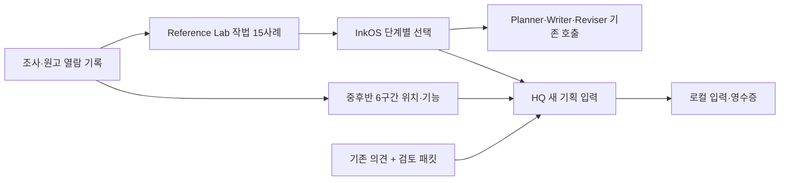

# 인간 웹소설 작가 아젠다: 구현과 사용

2026-09-12. [전체 설계](2026-09-12-human-webnovelist-full-design.md)를 실제 입력·기억·집필·수정 경로로 옮긴 기록이다. [첫 실행 기록](2026-09-12-human-webnovelist-two-hour-run.md)과 [시간 제한 해제 후 구현·검증](2026-09-12-human-webnovelist-continuation.md)에 진행 시각과 결과를 남긴다.

## 이번에 바꾼 동작

조사 내용을 작법 질문 목록에만 두지 않고, **현재 문제에 맞는 참고를 고르고 실제 호출에 전달하는 코드**를 만들었다. 오래된 기억·다른 인물의 관점·한국어 검색 누락 때문에 판단이 어긋나는 경로도 고쳤다. 새 사람 HIL과 장면 생성 비교를 구현의 선행 조건으로 두지 않았다.

| 이전 경로의 문제 | 구현한 동작 |
|---|---|
| 자료는 많지만 어느 단계에 무엇이 들어가는지 확인하기 어려움 | 작법 사례의 단계·선택 이유·원문 범위·설정·실제 렌더링을 해시와 함께 기록 |
| 중·후반을 조사해도 기획 모델에는 원문 앞 7,000자만 전달 | 선정 참고작에 해당하는 이미 읽은 중·후반 구간을 최대 1개 추가 |
| 과거 ‘싫음’만 전달되고 당시 본문은 없음 | 검토 패킷·후보 해시가 맞는 로컬 본문을 읽어 정확한 의견 대상에 연결 |
| 한글을 검색어로 충분히 회수하지 못함 | 조사·활용형을 고려한 검색어와 한국어 목표·갈등 우선순위 추가 |
| 오래된 믿음이 검색어에 잘 맞아 최신 판단을 밀어냄 | 같은 인물·관점 분류의 최신 기록을 함께 우선 배치하고 날짜 유지 |
| 과거 회차 재작업에 현재 사실이나 뒤늦은 폭로가 섞임 | 해당 회차 이전 스냅샷·사실 유효 기간·출처 회차로 조회 제한 |
| 한글을 영문처럼 4자당 1토큰으로 계산 | 한글·가나도 한자와 함께 계산하는 입력 예산 추정으로 수정 |
| ‘감정은 몸짓’, ‘상대는 항상 영리한 반격’ 같은 일률적 지침 | 선택 이유에 필요한 내면·오판·관계 장면·의도한 문장 호흡을 보존하도록 조건화 |

이 변화는 ‘사람과 같은 사고 능력을 얻었다’거나 ‘세 작가 수준의 원고를 쓴다’는 판정이 아니다. 실제 모델 입력과 상태 처리의 개선이며, 독자의 재미·연독·구매 의향을 측정하지 않았다.

## 1. 조사에서 집필 입력까지



`author-craft-pack/v1`은 출처, 읽은 범위, 관찰, 활용 방법, 보존할 장점, 적용하지 않을 경우를 갖는다. 기본값은 최대 3사례·6,000자다. 입력 공간이 부족하면 사례를 통째로 뺀다. 관련 없는 질의는 빈 입력으로 남기며, 카드 전체를 읽었다고 가정하거나 항목 충족을 강제하지 않는다.

실제 사례는 [Reference Lab 팩](../edge_repos/firefly_reference_lab/craft_packs/korean-author-craft/README.md)에 있다. 주제는 독자가 보고 싶은 순간, 판단 수정, 상대의 목적, 공개 명분과 속말, 공개 순서, 결단의 내면, 성취 뒤 생활, 다음 욕망, 조연의 삶, 대사 식별, 지면, 경험, 초고의 발견, 수정 원인, 의견의 범위다.

InkOS는 단계별로 현재 목표·메모·의도·수정 지시와 관련된 사례를 고른다. 자료는 해당 모델 호출의 user 입력에 추가되며 Observer와 Settler에 일괄 주입되지 않는다. 별도 생각 서버·에이전트 호출·RLHF 학습은 추가하지 않았다.

`story/runtime/author-craft/`의 영수증에는 선택한 사례뿐 아니라 제외한 사례, 질의 해시, 선택 근거, 분량, 입력 예산이 남는다. 제작 실행은 Book의 선택 설정과 팩 해시를 기존 production-input 영수증에 결합한다.

`inkos craft history <book-id>`로 회차·단계별 기록을 확인할 수 있다. 렌더링 해시와 파일명에 결합된 영수증을 검사하고, 손상된 기록은 따로 표시한다. 원문을 출력하거나 다시 생성하지 않는다.

현재 HQ 팩은 v2다. v1에서 작법 용어를 쓰지 않은 문제 6개를 모두 놓친 것을 확인하고, 일상적인 표현을 검색어에 보강했다. [32개 문제 점검](evidence/2026-09-12-author-craft-retrieval-probes-v2.json)은 직접 용어 15개, 바꿔 말한 표현 12개, 무관한 입력 5개의 예상 선택과 일치했다. 개발 중 만든 예제이며 독립적인 사람 평가나 일반 의미 검색 정확도는 아니다. [v1 결과](evidence/2026-09-12-author-craft-retrieval-probes.json)와 기존 팩도 보존했다.

## 2. 실제 원고를 전달하는 범위

[중·후반 연구](../edge_repos/firefly_reference_lab/comparisons/2026-09-11-author-craft-mid-late.md)의 6회차를 기능별 색인으로 연결했다. 원작의 실제 문장을 공개 팩에 복사하지 않는다. 로컬 원문에서 이전 열람 기록과 같은 파일·구간을 확인한 뒤 입력에 붙인다.

- 원본 바이트 SHA, 정규화된 구간 SHA, 1부터 시작하는 행 범위, 본문 회차와 파일 순번을 구분한다.
- HQ의 현재 선정 참고작과 해당 작법 사례에 맞는 구간만 선택한다. 다른 작품의 원문을 몰래 보태지 않는다.
- 기본값은 최대 1구간·7,500자다. 전체 구간이 맞지 않으면 자르지 않고 생략한다.
- 원문 파일이 없으면 생략 사유를 기록한다. 파일이 바뀌어 해시가 다르면 옛 좌표를 적용하지 않는다.
- 『금수저 투자백서』의 본문 597화를 파일의 584번째 경계와 혼동하지 않는다. 원문 6구간을 전집 독해·연속 아크 회수 검증으로 표시하지 않는다.

현재 이 원문 장면 경로는 **HQ 기획 입력**에 연결했다. InkOS의 작법 팩은 파생 참고를 전달하고, InkOS 자료 검색은 기존 material library를 사용한다. Reference Lab의 개인 원문을 모든 Book으로 자동 복제하는 경로는 만들지 않았다.

## 3. 인물이 무엇을 알고 왜 행동하는지

기존 `entityObservations`에 선택적인 `perspective`를 추가했다. 값은 `belief`, `desire`, `intention`, `experience`, `public-claim`이다. 별도 모델 호출 없이 기존 Observer·Settler가 정확한 본문 인용에 분류를 붙일 수 있다.

인물 이름과 근거가 실제 본문의 연속된 인용에 있어야 저장한다. 인물의 믿음은 객관적 사실로 바꾸지 않는다. 대사를 진심으로 간주하지 않고 공개 발언으로 구별하며, 모호한 심리는 추가 설명 필드로 발명하지 않게 했다. 기존 회차 재적용·롤백 경로를 사용하므로 수정에서 삭제된 근거는 새 관찰로 남지 않는다.

조회에서는 현재 문제와 관련된 오래된 경험을 회수할 수 있다. 믿음·욕망·의도는 같은 이름·분류의 최신 기록도 먼저 배치한다. 이것은 두 기록이 같은 주제이거나 서로 반박한다고 자동 판정하는 의미 분석은 아니다.

한국어 시점 표기와 회차 경계를 읽고, 명시적 시점 인물이 있으면 Writer 문맥에서 다른 인물의 분류된 관점을 제외한다. 기존 한국어 인물 정보표와 hook 표는 인물 열을 정확히 찾아 거른다. 여러 시점이거나 근거가 모호하면 단일 시점을 지어내지 않는다. 모든 서술·아웃라인의 지식을 완전히 분리하는 독자 지식 장부는 아직 없다.

과거 회차를 다시 쓸 때는 복선도 당시 스냅샷을 우선한다. 당시 목록이 비어 있었다면 현재의 복선을 대신 채우지 않는다. 정보 경계 아래에 소제목이 있어도 표 필터를 유지한다.

## 4. 참고자료와 원고의 목소리

자료 검색은 파일 첫머리에 우연히 나온 검색어 하나보다 여러 관련 검색어가 모이는 구간을 발췌한다. 조회 결과에는 보관된 Markdown의 UTF-16 위치·UTF-8 바이트 위치·파일 해시·발췌 해시가 붙는다. 원본 PDF의 페이지 좌표와 같은 것으로 해석하지 않는다.

한국어 방법론의 고정 문구를 조정했다. 내면이 선택 이유를 전달한다면 보존하고, 이미 전달된 감정 해설과 구분한다. 주변 인물이 모두 주인공에게 영리하게 반격하거나 매번 감정이 뒤집힐 필요는 없다. 화자 식별·농담·인물의 사익·생활·의도한 반복을 문장 길이 점수 때문에 삭제하지 않는다.

기존 사용자 문체 파일 전체를 자동으로 바꾸지 않는다. 기존 공통 방법론을 읽을 때 알려진 기본 문구에 한정해 호환 처리를 한다. `아마추어`의 ‘아마’와 같은 부분 문자열을 AI식 완곡 표현으로 세는 오탐도 줄였다. 탐지 점수는 인간 작성 여부나 원고 품질의 증명이 아니다.

## 5. 과거 의견을 쓰는 방법

기존 `scope_hil()`의 최신 후보별 의견, 같은 시각의 상충 의견, 원본 보존과 정확한 중복 묶음을 유지한다. 로컬 검토 패킷은 Storyyard의 현재 계약 검증 코드로 읽고 다음을 확인한다.

| 대상 | 확인·처리 |
|---|---|
| 특정 후보 의견 | 패킷·후보·작품 식별자와 해시가 모두 맞는 후보 표현 |
| 패킷 전체 의견 | 특정 후보를 임의로 고르지 않고 당시 후보 전체 표현 |
| 같은 본문에 여러 의견 | 본문 한 번만 넣고 각 의견의 연결 유지 |
| 누락·무효화·불일치 | 이유를 명시하고 본문 해석을 만들지 않음 |
| 분량 초과 | 본문 전체 표현을 생략하고 상태를 기록 |

기본 본문 한도는 3개 표현·20,000자다. 현재 구현은 최신순으로 제한된 본문을 싣는다. 후속 구현에서 InkOS 수정 경험을 별도로 저장하고, 동일 작품·편집 원인·실제 자동 선택 결과가 맞는 사례만 다음 Reviser에 전달한다. 후보·동률·선택되지 않은 수정·파싱 실패를 분리하며 사람의 선호 승인을 추정하지 않는다. 기존 Storyyard 의견의 원격 갱신은 자동화하지 않았다. 새 의견이 없어도 오프라인 입력 준비는 진행한다.

## 6. 바로 실행하기

HQ에서 원문을 포함한 입력만 준비한다. 외부 모델·Storyyard·Notion에 전송하지 않는다.

```sh
python3 scripts/prepare-author-input.py --date 2026-09-12
python3 scripts/prepare-author-input.py --date 2026-09-12 --query '같은 제안을 가족들이 다른 이유로 받아들이는 기획'
python3 scripts/prepare-author-input.py --date 2026-09-12 --query '위험을 감수할 이유' --case independent-counterparty --case belief-and-update
python3 scripts/prepare-author-input.py --date 2026-09-12 --feedback-file /path/to/saved-decisions.json
node scripts/validate-author-craft-assets.mjs --include-private-scenes
node scripts/probe-author-craft-retrieval.mjs
python3 scripts/inspect-author-input.py /path/to/saved-input --check-sources
python3 scripts/verify-author-craft.py --full --include-private-scenes --include-reuse-fixtures
```

기본 출력은 무시된 `.firefly/author-inputs/<date>/<inputBundleSha256>/`이다. 원문과 개인 의견이 포함될 수 있어 공개 문서에 본문을 복사하지 않는다. 같은 입력은 기존 디렉터리를 재사용한다. 본문·자료 묶음·영수증 내용이 다르면 기존 결과를 덮어쓰지 않는다.

문제를 지정하지 않으면 기존 일일 기획에 맞춘 기본 3사례를 사용한다. `--query`를 지정하면 전체의 기획 단계 사례에서 찾고, 문제 문장을 실제 입력에도 보존한다. `--case`는 반복해 명시적으로 고를 수 있다. 원문 장면은 선정 참고작·선택 사례 안에서 찾고, 사례 겹침 수가 같은 경우에는 현재 문제와 장면의 참고 기능이 얼마나 맞는지로 순서를 정한다.

실제 입력 확인에서 기본 기획은 서오 원고 639화 구간을 골랐다. ‘가족 각자의 경험과 걱정 때문에 같은 제안을 다르게 받아들인다’는 문제에서는 관계·겉말·상대 조건 사례와 강동호 원고 343화의 가족 반응 구간을 골랐다. 두 입력 모두 원본·분석·양식 해시가 현재 로컬 자료와 일치했다. 이 결과는 입력 선택의 변화이며 생성 원고의 재미를 평가한 결과는 아니다.

검사 명령은 원문·의견 본문을 출력하지 않고 참고작, 사례, 실제 장면, 과거 의견의 연결 수를 보여 준다. 저장된 입력의 해시 검증과 현재 원문·분석·양식의 변경 여부를 구분한다. `--check-sources` 없이 실행하면 과거 입력만 검사한다. 종료 코드는 정상 0, 저장 입력 손상 1, 과거 입력은 온전하지만 현재 자료가 바뀌거나 없는 경우 2다. 이 명령도 모델 호출과 새 사람 검토가 필요 없다.

마지막 검증 명령은 빌드, 관련 core·CLI 회귀, HQ 입력과 과거 의견, 원문 구간, 검색 문제를 묶어 실행한다. `--full`을 추가하면 InkOS core와 CLI의 전체 테스트를 사용한다. 로그와 검증 영수증은 `.firefly/validation/author-craft/`의 새 디렉터리에 남는다. 테스트 도중 검사 대상 코드가 바뀌면 성공으로 표시하지 않는다. 설치된 Node.js·pnpm과 로컬 의존성을 사용하며 제작 모델이나 외부 검토 서비스를 시작하지 않는다.

Book 단위 작법 자료 설정은 [InkOS 사용법](../edge_repos/inkos/docs/author-craft-inputs.md)을 따른다. 새 기능을 위한 HIL은 필요 없고, 기존 Book의 리뷰 모드와 제작 입장 조건은 그대로 적용된다.

## 7. 시간 제한 해제 후 확장한 실행 경로

첫 단계는 참고 입력·조회·문체 지침을 구현했다. 사용자가 시간 제한을 해제한 뒤 아래 모듈을 실제 기존 호출과 저장·조회에 연결했다. 기능별 세부 문서에 합성 fixture와 실제 실행 범위를 구별해 두었다.

| 영역 | 현재 구현 | 품질·적용 한계 |
|---|---|---|
| M01 작품 의도 | [Book 창작 의도](2026-09-12-book-creative-brief.md): 명시 독자 약속·선호·당시 검토 본문·회차 범위·출처를 Planner/Writer/Reviser에 전달 | 없는 취향·채택을 추정하지 않음. 회차 범위는 추가 투영에 적용되며 기존 원문 지시의 전체 차단 설정은 아님 |
| M02 장면 근거 | 15개 파생 사례, 6개 중후반 원문 구간, 문제별 검색·원본 해시·선택 기록 | 전체 작품 정독이나 독립 평가 corpus는 아님 |
| M03 상황 선택 | [장면 선택](2026-09-12-scene-decision-runtime.md): 기존 Planner에서 대안·선택 근거 기록, 실제 집필에는 선택한 장면만 전달 | 형식·전달 검증이며 문학적으로 최선의 선택이라는 보증은 아님 |
| M04 인물 관점 | 정확한 인용 기반 믿음·욕망·의도·경험·공적 발언, 회차·POV·최근 관점 변화 반영 | 인물별 의미와 행동의 설득력을 자동 입증하지 않음 |
| M05 공개 순서 | [서사 근거](2026-09-12-narrative-evidence.md): 독자 공개·인물 인지/무지/믿음을 분리하고 본문 변경을 재검증 | 인용에 붙인 관찰 분류. 독자 지식을 모든 인물에게 복사하지 않음 |
| M06 보상·관계 | 같은 명시 threadId·인물의 약속·획득·생활 체감·다음 욕망을 본문 순서로 전달 | 없는 단계를 결함으로 판정하거나 획득을 만족으로 추정하지 않음 |
| M07 문장·목소리 | 단계별 지침, 내면·의도한 반복·대사 기능 보존, 한국어 검색·예산·오탐 수정 | 실제 독자가 느끼는 호흡 향상은 별도 평가 |
| M08 초고의 발견 | [미래 계획 후보](2026-09-12-draft-discovery-integration.md): 기존 Settler의 인용 근거→원고/계획 해시 결속→다음 Planner/Rail 조회→기존 reflow 입력 | A·진행/완료 B·작성한 원고는 고정, 제안 자동 적용 없음 |
| M09 퇴고 | [수정 경험](2026-09-12-revision-experience-integration.md): 기존 Reviser의 정확한 before/after·결함·원본 보존·수정 실패 기록 | 모델의 FIXED_ISSUES를 수정 성공 판정으로 쓰지 않음 |
| M10 편집 경험 | 실제 ReviewCycle의 최종 선택 결과를 별도 기록하고 같은 원인에 맞는 과거 수정만 재사용 | 자동 선택은 사람의 품질·취향 승인이 아님; 동률/실패/상충 결과는 제외 |

[외부 집필 도구 실행 비교](2026-09-12-writing-system-reuse-validation.md)는 고정 원본 함수와 모의 모델로 22개 동작을 확인했다. 한국어 대사 누락·원문 없는 인용 수용·반복 호출 비용이 확인되어 앱 전체 도입은 보류하고, 검증 가능한 후보 어댑터와 기존 상태·목표 갱신 원리를 사용했다. 원본 캐시를 수정하지 않았고 실제 외부 모델은 호출하지 않았다.

[기획→InkOS 전달](2026-09-12-planning-inkos-handoff.md)은 원본 canary 반입과 명시 source/A·B/Arc/foundation/기존 planning 승인 검증을 실제 새 Book 생성·읽기까지 연결한다. 실제 저장된 기획이 제작 입력을 전부 갖췄다는 뜻은 아니다. 생성 테스트는 격리된 합성 Book이다.

별도의 열린 결말 Rail 모드는 추가하지 않았다. 현재 작업은 기존 A/B·가까운 Arc·먼 용량 예약으로 표현 가능하며, 새로운 mode를 도입해야 하는 실행 사례가 확인되지 않았다. 장면마다 압박·후속 사건을 강제하지 않는 지침은 기존 mode에서도 적용한다. 이후 유한 목표 회차 자체가 없는 작품을 실행할 때 별도 계약이 필요하다.

[첫 단계 18작업 대조표](evidence/2026-09-12-human-webnovelist-implementation-coverage.json)는 당시 상태로 보존한다. 이번 확장은 [계속 작업 기록](2026-09-12-human-webnovelist-continuation.md)에 이어 기록하며, 조사 107행의 과거 채택 표시를 일괄 완료로 바꾸지 않는다.

## 8. 운영 경계와 검증

HQ는 입력을 조립하고 상태·근거를 모은다. Reference Lab은 파생 사례와 원문 구간 참조를 소유한다. InkOS는 실제 집필·수정·상태를 소유한다. Storyyard에는 읽기 검증만 의존하며 직접 쓰지 않는다. Foundry·Market Radar의 코드를 이번 연결을 위해 바꾸지 않는다.

[정책 현황](pitch-policy-status.md)은 작법 입력과 새 명시 handoff 구현, 실제 기획의 입장 여부를 구별한다. 예약 실행도 별도다. 기존 Book 정사나 원고를 재생성하지 않은 상태에서 로컬 도구·격리된 fixture로 입력, 호출 수, 보존, 실패, 복구를 검증한다.

최신 검증 명령·전체 결과·Git 변경 범위는 [시간 제한 해제 후 완료 기록](2026-09-12-human-webnovelist-continuation.md)과 [현재 18작업 대조표](evidence/2026-09-12-human-webnovelist-continuation-coverage.json)에 있다. [첫 실행 기록](2026-09-12-human-webnovelist-two-hour-run.md)과 이전 에셋 검증은 당시 이력으로 보존한다. 사람의 독자 품질 비교는 수행하지 않았고 이번 구현의 필수 대기 단계로 요구하지 않았다.
